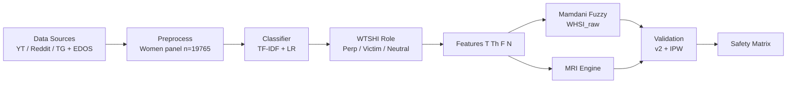

# BCSE497J — Project-I  
## Review-2 Initial Draft Report  
**Month:** September 2026  

> Paste into the official Word template (`reference doc/3 BCSE497J Project I Report - Template.docx`).  
> Apply template fonts: Title Times New Roman 16 Bold Upper Case; body TNR 12; headings as specified.  
> Figures: `docs/figures/fig2_system_architecture.png`, `fig3_dfd_level0.png`, `fig4_use_case.png`, `fig5_safety_matrix.png`.  
> **Science lock:** post-faculty August 2026 (IPW primary; no 5×; lit-adj appendix only; MRI Reddit 69.18).

---

# COVER PAGE

**BCSE497J Project-I**

**WOMEN ONLINE SAFETY INDEX: A DUAL-INDEX FRAMEWORK FOR MEASURING PLATFORM HARM AND MODERATION ACCOUNTABILITY**

| Reg. No. | Student Name |
|----------|--------------|
| 23BCB0157 | **NAINA JOSE** |
| 23BCE2155 | **TANVI SINGH** |
| 23BDS0294 | **TEJASHREE ELAYARAJA** |

*(Particulars sorted on Register number)*

**Under the Supervision of**

**Prof. Ilanthenral K P S K**  
Faculty  
School of Computer Science and Engineering (SCOPE)

**B.Tech.**  
in  
**Computer Science and Engineering**

School of Computer Science and Engineering

**September 2026**

---

# ABSTRACT

Online harassment directed towards women is a complex and recurring form of digital harm that cannot be adequately represented by conventional comment-level toxicity scores. Existing systems generally focus on identifying whether an individual post is toxic, abusive, or sexist, but provide limited support for evaluating platform-level harm and do not simultaneously account for the responsiveness of the platform when harmful content occurs. This project proposes a dual-index Women Online Safety framework consisting of the **Women Harassment Severity Index (WHSI)** and the **Moderation Responsiveness Index (MRI)**, supported by a **Women-Targeted Speech Harm Index (WTSHI)** for role-aware interpretation of online speech.

The proposed system processes a multi-platform corpus of **19,765 women-relevant comments** collected from YouTube, Reddit, and Telegram. Gendered-harm detection is performed using an EDOS-trained TF-IDF and logistic-regression classifier with frozen production thresholds. WTSHI subsequently distinguishes perpetrator-directed harmful speech from victim disclosure and neutral discussion, reducing the risk of treating support-space narratives as harmful content. WHSI combines WTSHI with a Mamdani fuzzy inference system based on Toxicity, Threat, Frequency, and Normalization. MRI independently represents moderation accountability using removal rate, response speed, and enforcement consistency derived from available transparency evidence.

The system was evaluated using Faculty Protocol v2 on an independent held-out set of **200 observations**, followed by inverse-probability weighting (IPW) to estimate corpus-level performance. The resulting weighted precision, recall, specificity, and F1-score were **0.295, 0.866, 0.708, and 0.440**, respectively. A subsequent Path A repair attempt using re-thresholding, topic filtering, and DistilBERT improved precision to **0.402**, but did not achieve the required 0.50–0.70 precision gate. Consequently, absolute cross-platform harm rankings are not claimed. Validation showed substantial differences in classifier sensitivity across platforms, with YouTube and Reddit forming a comparable-error pair while Telegram remained unsuitable for density-based comparison.

The resulting MRI scores were **82.28 for YouTube, 69.18 for Reddit, and 11.27 for Telegram**. The Safety Matrix therefore serves as a descriptive framework for examining the relationship between observed harm and moderation responsiveness rather than as a normative Safe/Unsafe ranking. The principal contribution of the project is an interpretable, role-aware dual-index architecture together with an explicit validation and claim-discipline methodology for responsible measurement of women’s online safety.

**Keywords** — Women Online Safety Index, WHSI, MRI, WTSHI, hate speech detection, content moderation, fuzzy inference, platform accountability, sexism detection.

---

# TABLE OF CONTENTS

| Sl.No | Contents | Page No. |
|-------|----------|----------|
| | **Abstract** | i |
| **1.** | **INTRODUCTION** | 1 |
| 1.1 | Background | 1 |
| 1.2 | Motivations | 1 |
| 1.3 | Scope of the Project | 1 |
| **2.** | **PROJECT DESCRIPTION AND GOALS** | |
| 2.1 | Literature Review | |
| 2.2 | Research Gap | |
| 2.3 | Objectives | |
| 2.4 | Problem Statement | |
| 2.5 | Project Plan | |
| **3.** | **TECHNICAL SPECIFICATION** | |
| 3.1 | Requirements | |
| 3.1.1 | Functional | |
| 3.1.2 | Non-Functional | |
| 3.2 | Feasibility Study | |
| 3.2.1 | Technical Feasibility | |
| 3.2.2 | Economic Feasibility | |
| 3.2.3 | Social Feasibility | |
| 3.3 | System Specification | |
| 3.3.1 | Hardware Specification | |
| 3.3.2 | Software Specification | |
| **4.** | **DESIGN APPROACH AND DETAILS** | |
| 4.1 | System Architecture | |
| 4.2 | Design | |
| 4.2.1 | Data Flow Diagram | |
| 4.2.2 | Use Case Diagram | |
| 4.2.3 | Class Diagram | |
| 4.2.4 | Sequence Diagram | |
| **5.** | **IMPLEMENTATION, EXPERIMENTS AND RESULTS** | |
| 5.1 | Modules Implemented | |
| 5.2 | Experimental Setup | |
| 5.3 | Results | |
| 5.3.1 | Inter-Annotator Agreement | |
| 5.3.2 | Classifier Performance (Unweighted vs IPW) | |
| 5.3.3 | Path A Instrument Repair | |
| 5.3.4 | Platform WHSI Results | |
| 5.3.5 | MRI Results | |
| 5.3.6 | Safety Matrix | |
| 5.3.7 | Rogan–Gladen Prevalence Correction | |
| 5.3.8 | Claim Boundaries | |
| 5.4 | Discussion and Limitations | |
| **6.** | **CONCLUSION AND FUTURE WORK** | |
| 6.1 | Conclusion | |
| 6.2 | Future Work | |
| **7.** | **REFERENCES** | |

---

# 1. INTRODUCTION

## 1.1 Background

Women-targeted online harassment is a patterned form of harm with its own taxonomies and failure modes, not a residual subtype of generic toxicity. Large platforms host millions of comments daily; researchers and regulators increasingly ask not only whether a single comment is sexist, but whether an entire platform is comparatively more hostile for women and whether that platform responds when harm is flagged.

Existing hate-speech and toxicity systems — logistic regression on bag-of-words, CNNs/LSTMs, and transformer models such as BERT and HateBERT — operate almost exclusively at the comment level. Benchmarks such as Davidson, EDOS, HateXplain, and Jigsaw Toxicity evaluate post classification accuracy, not platform-level safety. Parallel work on Digital Services Act transparency reporting and moderation delays shows that self-reported accountability data can be inconsistent and that slow removals often occur after most users have already been exposed.

This project therefore builds a dual-index framework: **WHSI** aggregates women-targeted harm severity on a scraped panel, and **MRI** scores moderation accountability. Together they form a **Safety Matrix** that separates user-side harm from platform-side response — a distinction a single toxicity number cannot make.

## 1.2 Motivation

Three practical failures motivate the work. First, comment-level classifiers cannot answer “is Platform A structurally more dangerous for women than Platform B?” Second, standard sexism detectors conflate perpetrator attack with victim disclosure, inflating harm scores in support spaces (e.g., Reddit’s TwoXChromosomes). Third, platforms with closed architectures (notably Telegram) can appear “safe” under scrape-only methods because harmful content is structurally invisible — not because it is absent.

Faculty validation further showed that optimistic in-sample metrics (June F1 ≈ 0.93, κ = 1.00) do not survive independent held-out evaluation. The project is therefore motivated both by the need for a dual index and by the need for honest instrument validation — reporting what the tool can and cannot claim after IPW and Path A.

## 1.3 Scope of the Project

**In scope**
- Live women-relevant scrapes: YouTube (12,661), Reddit (4,727), Telegram (2,377); total live WHSI denominator **19,765**.
- Training/holdout anchor: SemEval-2023 Task 10 EDOS; historical Davidson Twitter panel for supplementary validation only.
- Dual indices WHSI and MRI; WTSHI role filter; Mamdani fuzzy scoring; Safety Matrix.
- Human validation Protocol v2 (*n* = 200), IPW corpus metrics, Path A attempt, hotspot audit, repeat-offender analytics.

**Out of scope / deferred**
- Live operational moderation deployment (TRL 5+).
- Absolute Unsafe/Safe normative labels keyed to classifier rates.
- Telegram literature-adjusted point estimates in primary results (appendix framework only).
- Journal paper and patent filing (planned outcomes; Final Review).

**Implementation status (Review 2):** The **technical pipeline and validation experiments are complete**. Overall project completion is approximately **90%**, with remaining work limited to documentation packaging, final academic dissemination (journal), and planned intellectual-property activities (patent).

---

# 2. PROJECT DESCRIPTION AND GOALS

## 2.1 Literature Review

*(Condensed from `Literature_Review_IEEE_Survey.docx` / Chapter 2 survey — ≥50 papers. Full IEEE survey is the authoritative long form; this section is the Report Template digest.)*

### 2.1.1 Women-targeted harassment detection

Guest et al. (2021) showed that crowdsourced annotators struggle with Reddit misogyny and that hierarchical expert labels are required. Kirk et al. (2023) made fine-grained sexism a shared-task standard via EDOS. Subsequent systems use transformers and hybrids: Prithila et al. compared BanglaBERT/m-BERT for misogyny; Martinez et al. combined lexical features with RoBERTa ensembles on SemEval-2023 Task 10; Abburi et al. built multi-label semi-supervised sexism classifiers; Mohasseb & Amer used ConceptNet enrichment; multimodal meme work (MAMI) and modular specialists (AD-ASH) address subtype heterogeneity. Across these studies, comment-level F1 can be high on in-domain benchmarks, but none aggregate to a platform women’s harm score or separate perpetrator from victim speech before scoring.

### 2.1.2 Hate speech and toxicity models

Davidson et al. (2017) established hate vs offensive vs neither. Fortuna & Nunes (2018) surveyed definitional inconsistency. Mozafari et al. (2020) and Caselli et al. (2021, HateBERT) established transformer fine-tuning / domain adaptation. Systematic reviews (Jahan & Oussalah 2023; Rawat et al. 2024; Ramos et al. 2024; MetaHate / Piot et al. 2024) confirm transformer dominance and persistent cross-domain degradation. LLM comparisons (Pan et al. 2024; Ghorbanpour et al. 2025) often still favour fine-tuned encoders on well-defined taxonomies — the rationale for this project’s EDOS-trained TF-IDF logistic regression blended with Detoxify rather than a zero-shot LLM alone.

Pamungkas et al. (2020) showed cross-domain misogyny transfer failure. Parikh et al. (2021) argued for fine-grained sexism taxonomies. Liu et al. (2019) motivated fuzzy handling of ambiguous hate. Lees et al. (2022) document Perspective API as an ensemble toxicity component. Alkomah & Ma (2022) support multi-dimensional harm constructs (T, Th, F, N).

### 2.1.3 Datasets and benchmarks

Waseem & Hovy (2016), Davidson (2017), Founta (2018), Basile HatEval (2019), Guest (2021), Kirk EDOS (2023), HateXplain (2021), Jigsaw Toxic / Unintended Bias, HateCheck / mHateCheck, and Kennedy et al. (2020) Rasch severity collectively show: Twitter-centric sampling historically, definitional inconsistency (Fortuna et al. 2020; Poletto et al. 2021), and **no speaker-role (perpetrator vs victim) schema**. Arora et al. (2023) note the mismatch between academic post-level detection and platform system-level needs.

### 2.1.4 Platform-level analysis

DRAGNET++ (Meng et al.) predicts hate intensity from conversation trees with GNNs. La Gatta et al. show moderated YouTube videos still spread on Twitter. Zahrah et al. compare Reddit vs 4chan election discourse; Vasist et al. show Twitter vs Reddit structure shapes geopolitical discourse. Agenda-setting news-comment models (Kim et al.) and cyberbullying transformer comparisons (Philipo et al.) reinforce that context and architecture matter — but still stop short of a women-specific platform index.

### 2.1.5 Moderation and accountability

Trujillo et al. audited 353M DSA-TDB records and found reporting inconsistencies. Shahi et al. analysed 1.58B actions around the 2024 EU elections and found little adaptation plus persistent vague categories (~41% “scope of platform service”). Schneider & Rizoiu (PNAS) used Hawkes processes to show 24-hour takedown effectiveness depends on content half-life. Truong et al. (SimSoM + DSA-TDB) estimated multi-day to multi-month average delays (e.g., TikTok ~6 days, Instagram ~87, YouTube ~286). Zangl et al. critique opaque toxicity APIs; Gomez et al. show ~30–34% seed-dependent decision disagreement in moderation models. Chandrasekharan et al., Ribeiro et al., and Dubois & Reepschlager contextualise Reddit bans, automated moderation effects, and policy evolution — inputs to MRI sub-metrics (MBR, PDR, RAS).

### 2.1.6 Explainable scoring and fuzzy logic

Zadeh (1965) and Mamdani & Assilian (1975) supply the fuzzy controller foundation. Liu et al. (2019) apply fuzzy methods to ambiguous hate. Kennedy et al. (2020) argue for continuous severity. HateXplain and Röttger et al. (2022) annotation paradigms inform explainability and gold-label design. These methods exist but are not assembled as an explainable dual index for women.

*(Full numbered bibliography: Section 7 and `Literature_Review_IEEE_Survey.docx`.)*

## 2.2 Research Gap

1. **No platform-level aggregation** of women-targeted harm into a comparable severity index.  
2. **Harm and accountability conflated** — toxicity counts ignore how platforms respond.  
3. **Victim disclosure misclassified as harm** — no role-aware benchmark schema.  
4. **Visibility bias** — closed platforms can look safe under scrape-only measurement; no primary claim should treat low scrape flags as safety.  
5. **Validation honesty** — field ceiling and cross-domain drop mean live multi-platform deployment requires held-out + IPW evaluation, not in-sample optimism alone.

This project addresses (1)–(3) via WHSI × MRI with WTSHI; treats (4)–(5) as first-class methodological constraints rather than afterthoughts.

## 2.3 Objectives

1. Design and validate a gendered-harm classifier with a **WTSHI** role layer (perpetrator / victim / neutral), grounded in human gold labels — not proxy sexism datasets alone.  
2. Develop **WHSI** as an interpretable fuzzy platform harm score over T, Th, F, N (`WHSI_raw = 0.70×WTSHI + 0.30×fuzzy`).  
3. Develop **MRI** integrating transparency-reported removal, speed, and consistency (PDR/RAS), keeping empirical probes standalone when category-distinct.  
4. Construct a **Safety Matrix (WHSI × MRI)** that separates high-harm/weak-moderation patterns from high-harm/strong-moderation patterns **descriptively**.  
5. Validate with Protocol v2 IAA, IPW corpus metrics, Rogan–Gladen where defined, Monte Carlo weight sensitivity, and Path A instrument repair attempt.  
6. Document claim boundaries: no absolute cross-platform danger ranking; Telegram not density-comparable; lit-adj / EHER appendix-only until classifier meets faculty precision gate.

## 2.4 Problem Statement

Toxicity tools flag comments; they do not produce platform-level women’s safety scores that separately measure (a) severity/density of women-targeted harm and (b) moderation accountability. Without WTSHI, support-space victim language inflates harm. Without honest validation, optimistic in-sample metrics overstate deployability. The problem addressed is therefore: **build and validate a dual-index WHSI × MRI framework on multi-platform live scrapes, with role-aware filtering and faculty-grade evaluation that reports instrument limits as part of the contribution.**

## 2.5 Project Plan

| Phase | Window | Tasks | Status |
|-------|--------|-------|--------|
| 1 | Jan–Mar 2026 | Problem definition, lit survey, scrape design | Done |
| 2 | Apr–May 2026 | Data collection (YT/Reddit/TG), EDOS training | Done |
| 3 | May–Jun 2026 | Classifier, WTSHI, fuzzy WHSI, MRI v1 | Done |
| 4 | Jun–Jul 2026 | June annotation, Review-1, Safety Matrix | Done |
| 5 | Jul–Aug 2026 | Protocol v2, IPW, Path A, faculty sign-off B+C | Done |
| 6 | Sep 2026 | Review-2 report/PPT, documentation | **In progress** |
| 7 | Oct 2026 | Final Review, journal/patent drafts | Planned |

**Fig. 1. Gantt chart (textual)**

```
Task                         | J | F | M | A | M | J | J | A | S | O
Lit survey & design          |##|##|##|  |  |  |  |  |  |  
Data scrape & preprocess     |  |  |##|##|##|  |  |  |  |  
Classifier + WTSHI + fuzzy   |  |  |  |##|##|##|  |  |  |  
MRI + Safety Matrix          |  |  |  |  |##|##|##|  |  |  
Validation (v2/IPW/Path A)   |  |  |  |  |  |##|##|##|  |  
Review-2 documentation       |  |  |  |  |  |  |  |##|##|  
Final Review / journal       |  |  |  |  |  |  |  |  |##|##
```

---

# 3. TECHNICAL SPECIFICATION

## 3.1 Requirements

### 3.1.1 Functional

- **Data ingestion:** Collect and store women-relevant comments from YouTube, Reddit, and Telegram public channels; ingest EDOS and Davidson for train/validation.  
- **Preprocessing:** Deduplicate, normalise text, build women-relevant panel (*n* = 19,765 live).  
- **Gendered-harm classification:** Score sexism and threat probabilities; apply frozen perpetrator rule (sexist ≥ 0.40, or sexist ≥ 0.34 with threat ≥ 0.28, or attack keywords; victim regex suppresses).  
- **WTSHI role assignment:** Label perpetrator attack / victim disclosure / neutral.  
- **Feature extraction:** Compute T, Th, F, N (+ VIS/MBR as configured).  
- **Fuzzy WHSI:** Mamdani inference; output `WHSI_raw` and category.  
- **MRI computation:** Removal rate, speed score, consistency, PDR/RAS from transparency (+ standalone empirical probe).  
- **Safety Matrix:** Plot/join WHSI_raw vs MRI with descriptive regions.  
- **Validation:** Dual annotation support, IAA, IPW weighting, confusion exports, Path A experiments.  
- **Reporting:** Export CSV/JSON tables and figures for faculty packs.

### 3.1.2 Non-Functional

- **Reproducibility:** Frozen thresholds with config hash; seeded sampling (`20260712`, `20260804`).  
- **Interpretability:** Fuzzy rules and WTSHI roles must remain inspectable (not black-box-only).  
- **Honesty / safety-of-claims:** Primary tables must not include retired claims (5×, Telegram lit-adj 53.88, normative Unsafe/Safe).  
- **Maintainability:** Modular Python package under `src/`.  
- **Performance:** Batch scoring of ~20k comments on a laptop/CPU acceptable for research pipeline (not real-time moderation SLA).  
- **Privacy:** Use public scrapes / published corpora; no private chat intrusion.

## 3.2 Feasibility Study

### 3.2.1 Technical Feasibility

Python, scikit-learn, fuzzy engines, and public APIs/scrapers are available. EDOS and transparency reports exist. Faculty Path A showed DistilBERT did not clear the precision gate on this gold — confirming that “more transformers” is not automatically feasible as a fix. The dual-index architecture itself is technically demonstrated end-to-end.

### 3.2.2 Economic Feasibility

Student-scale compute (laptop/CPU) and free/open datasets keep cost low. Annotation labour is the main non-compute cost (June *n*=360; v2 *n*=200 dual). No paid cloud dependency for core results.

### 3.2.3 Social Feasibility

Aligns with SDG 5 (Gender Equality) and SDG 16 (institutions/accountability). Ethical risk is misrepresenting platforms; mitigated by claim discipline after faculty review. Annotator guidelines and adjudication logs support responsible labelling.

## 3.3 System Specification

### 3.3.1 Hardware Specification

| Component | Specification (used / recommended) |
|-----------|-------------------------------------|
| Processor | Multi-core CPU (Apple Silicon / Intel i5+) |
| Memory (RAM) | ≥ 16 GB recommended |
| Storage | ≥ 20 GB free for data + models |
| GPU | Optional (Path A DistilBERT); not required for production TF-IDF pipeline |
| Monitor | Standard 1080p+ for matrix/plots |

### 3.3.2 Software Specification

| Layer | Choice |
|-------|--------|
| OS | macOS / Linux |
| Language | Python 3.10+ |
| Core libs | pandas, numpy, scikit-learn, scipy |
| NLP | EDOS-trained TF-IDF+LR; optional Detoxify / transformers (Path A) |
| Fuzzy | Custom Mamdani engine (`src/fuzzy_engine.py`) |
| MRI | `src/mri_engine.py` |
| Integration | `src/integrated_scoring.py`, `src/safety_matrix.py` |
| Config | `configs/perpetrator_thresholds_frozen.json` |
| Data | `data/processed/master_women_relevant.csv` |

---

# 4. DESIGN APPROACH AND DETAILS

## 4.1 System Architecture

**Fig. 2. System Architecture** — see `docs/figures/fig2_system_architecture.png`.

**ASCII / dotted flowchart**

```
┌──────────────┐   ┌──────────────┐   ┌──────────────┐   ┌──────────────┐
│ DATA SOURCES │──▶│  PREPROCESS  │──▶│  CLASSIFIER  │──▶│ WTSHI ROLE   │
│ YT/Reddit/TG │   │ n=19,765     │   │ TF-IDF + LR  │   │ P / V / N    │
│ + EDOS/Dav.  │   │ women panel  │   │ frozen thr.  │   │              │
└──────────────┘   └──────────────┘   └──────┬───────┘   └──────┬───────┘
                                             │                  │
                    ┌────────────────────────▼──────────────────▼────────┐
                    │ FEATURES [T, Th, F, N] + VIS/MBR                   │
                    └───────────────┬─────────────────────┬──────────────┘
                                    │                     │
                    ┌───────────────▼──────┐   ┌──────────▼──────────┐
                    │ MAMDANI FUZZY WHSI   │   │ MRI ENGINE          │
                    │ WHSI_raw=0.7·WTSHI   │   │ remove/speed/consist│
                    │        +0.3·fuzzy    │   │ + PDR/RAS           │
                    └───────────────┬──────┘   └──────────┬──────────┘
                                    │                     │
                    ┌───────────────▼─────────────────────▼──────────┐
                    │ VALIDATION (Protocol v2, IPW, Path A audit)    │
                    └───────────────────────┬────────────────────────┘
                                            │
                              ┌─────────────▼─────────────┐
                              │ SAFETY MATRIX (WHSI×MRI)  │
                              │ + exports / faculty packs │
                              └───────────────────────────┘
```

**Mermaid (paste into tools that render Mermaid)**



**Explanation:** Raw multi-platform text is filtered to a women-relevant live panel, classified for gendered harm, role-filtered by WTSHI, converted to linguistic features, scored by a Mamdani fuzzy engine into WHSI, and paired with MRI from transparency/accountability inputs. Validation gates what may be claimed; the Safety Matrix is the comparative display.

## 4.2 Design

### 4.2.1 Data Flow Diagram *(Mandatory)*

**Fig. 3.** `docs/figures/fig3_dfd_level0.png`

External entities: Social Media Platforms, Transparency Reports, Human Annotators, Researcher/Analyst, Faculty Review Panel.  
Central process: Women Online Safety Index System.  
Flows: comments/metadata in; gold labels in; WHSI/MRI/Matrix and validation metrics out.

### 4.2.2 Use Case Diagram *(Mandatory)*

**Fig. 4.** `docs/figures/fig4_use_case.png`

Actors: Analyst, Annotator.  
Use cases: Ingest data; Classify gendered harm; Assign WTSHI role; Compute WHSI; Compute MRI; Build Safety Matrix; Validate (IAA/IPW); Export reports.

### 4.2.3 Class Diagram *(Optional — included)*

```
┌─────────────────────┐     ┌─────────────────────┐
│ CommentRecord       │     │ HarmClassifier      │
│ +platform           │     │ +predict(text)      │
│ +text               │────▶│ +thresholds         │
│ +sexist_proba       │     └─────────────────────┘
│ +threat_proba       │
│ +harm_role          │     ┌─────────────────────┐
│ +T,Th,F,N           │────▶│ FuzzyEngine         │
└─────────────────────┘     │ +compute_whsi()     │
                            └─────────────────────┘
┌─────────────────────┐     ┌─────────────────────┐
│ PlatformAggregate   │     │ MRIEngine           │
│ +WHSI_raw           │────▶│ +compute_mri()      │
│ +MRI_score          │     └─────────────────────┘
│ +n_comments         │
└─────────────────────┘     ┌─────────────────────┐
           │                │ SafetyMatrix        │
           └───────────────▶│ +assign_region()    │
                            └─────────────────────┘
```

### 4.2.4 Sequence Diagram *(Optional — included)*

```
Analyst -> Pipeline: run_pipeline(platforms)
Pipeline -> Scraper: load_master_panel()
Scraper --> Pipeline: DataFrame(n=19765)
Pipeline -> Classifier: score_batch(texts)
Classifier --> Pipeline: sexist/threat probs
Pipeline -> WTSHI: assign_roles()
WTSHI --> Pipeline: perp/victim/neutral
Pipeline -> Fuzzy: compute_whsi(T,Th,F,N)
Fuzzy --> Pipeline: WHSI_raw
Pipeline -> MRI: compute_mri(platform)
MRI --> Pipeline: MRI_score
Pipeline -> Matrix: plot(WHSI_raw, MRI)
Pipeline -> Validator: evaluate_heldout_ipw()
Validator --> Analyst: metrics + figures
```

---

# 5. IMPLEMENTATION, EXPERIMENTS AND RESULTS

## 5.1 Modules Implemented

| Module | Path / role | Status |
|--------|-------------|--------|
| Master panel build | `data/processed/master_women_relevant.csv` | Done |
| Gendered-harm classifier | EDOS TF-IDF+LR; frozen thresholds config | Done |
| WTSHI role layer | perpetrator / victim / neutral | Done |
| Fuzzy WHSI | `src/fuzzy_engine.py` | Done |
| Integrated scoring | `src/integrated_scoring.py` (`WHSI_raw = 0.70×WTSHI + 0.30×fuzzy`) | Done |
| MRI engine | `src/mri_engine.py` | Done |
| Safety Matrix | `src/safety_matrix.py` | Done |
| Protocol v2 + IPW | held-out gold + weight exports | Done |
| Path A | re-threshold, topic filters, DistilBERT attempt | Done (gate not met) |
| Hotspot audit | quarantine of FP channels | Done |
| Faculty packs | `docs/FACULTY_*` | Done |

The technical pipeline and validation experiments are complete. Overall project completion is approximately **90%**, with remaining work limited to documentation packaging, journal (Scopus) preparation, and planned patent filing for the Final Review.

## 5.2 Experimental Setup

The live evaluation corpus comprises **19,765 women-relevant comments**: YouTube 12,661, Reddit 4,727, and Telegram 2,377. Training and threshold development used the SemEval-2023 Task 10 EDOS corpus as the primary sexism/threat anchor; Davidson Twitter data was retained only as a historical supplementary panel and is not part of the live ranking.

The production classifier is an EDOS-trained TF-IDF logistic regression model with frozen thresholds: sexist probability ≥ 0.40, or sexist ≥ 0.34 with threat ≥ 0.28, or perpetrator keyword match, with victim-regex suppression. Thresholds were selected on the June in-sample set (*n* = 360) and then frozen so that they could not be re-tuned on the held-out gold.

Primary validation followed Faculty Protocol v2.0. A fresh stratified sample of **200** comments (seed **20260712**, no June overlap) was dual-annotated independently. Stratification by platform × confidence band was intentional for inter-annotator agreement coverage of hard cases, but it over-represents high-score false positives relative to the live corpus. Inverse-probability weighting (IPW) with weights \(w = N_{p,b}/n_{p,b}\) was therefore applied to recover corpus-level estimates. Path A experiments (topic veto, re-thresholding, DistilBERT) were tuned only on June data and evaluated on the IPW-weighted v2 set.

| Item | Detail |
|------|--------|
| Live corpus | 19,765 women-relevant comments (YT 12,661; Reddit 4,727; TG 2,377) |
| Train anchor | EDOS (SemEval-2023 Task 10) |
| Production rule | sexist≥0.40 OR (sexist≥0.34 & threat≥0.28) OR keywords; victim suppress |
| Primary validation | Protocol v2, *n*=200, seed 20260712, dual independent labels |
| IAA | κ (perpetrator) = **0.588**; κ (3-class role) = **0.449** |
| Corpus metrics | IPW-weighted P/R/Sp/F1 |
| Path A | June-tune only; eval on IPW-v2; DistilBERT fallback |

## 5.3 Results

The scientific narrative of the experiments is a validation spine rather than a single accuracy headline: early keyword-style baselines near ~2%, observed production flag densities near ~30% on YouTube/Reddit, optimistic June in-sample F1 ≈ 0.93, independent held-out unweighted F1 ≈ 0.36, IPW corpus F1 ≈ 0.44 with specificity ≈ 0.71, Path A precision 0.402 (gate missed), and pool Rogan–Gladen corrected YouTube/Reddit prevalence on the order of ~3–5%. That arc is the evidence base for claim discipline in the remainder of this chapter.

### 5.3.1 Inter-Annotator Agreement

Protocol v2 dual labelling on *n* = 200 produced **177** agreements (88.5%) and **23** disagreements (11.5%), all of which were adjudicated. Cohen’s κ for binary perpetrator classification was **0.588**, within the range commonly reported for subjective hate/sexism tasks. Three-class role agreement (perpetrator / victim / neutral) was lower at κ = **0.449**, confirming that speaker-role labelling is meaningfully harder than binary harm flags and motivating WTSHI as an explicit design component rather than an afterthought.

| Metric | Value |
|--------|-------|
| *n* dual-labelled | 200 |
| Agree | 177 (88.5%) |
| Disagree | 23 (11.5%) |
| Cohen’s κ (perpetrator) | **0.588** |
| Cohen’s κ (3-class role) | **0.449** |
| Adjudicated | 23 |

### 5.3.2 Classifier Performance (Unweighted vs IPW)

Because the held-out sample was stratified, unweighted metrics describe the sample and systematically understate corpus specificity. IPW restores corpus mass and is therefore the primary reporting table.

| Metric | Unweighted (stratified sample) | **IPW-weighted (corpus)** |
|--------|--------------------------------|---------------------------|
| Precision | 0.233 | **0.295** |
| Recall / Se | 0.824 | **0.866** |
| Specificity | 0.446 | **0.708** |
| F1 | 0.364 | **0.440** |

Unweighted confusion on the sample was TN=74, FP=92, FN=6, TP=28. June *n*=360 F1≈0.93 / κ=1.00 is retained only as an **in-sample / threshold-tuning** reference and is not treated as independent validity.

### 5.3.3 Path A Instrument Repair

Path A tested whether precision could be raised into the faculty gate of 0.50–0.70 without contaminating the held-out gold. Candidates were selected on June data only and evaluated under IPW on Protocol v2.

| Candidate | Precision | Recall | Specificity | F1 |
|-----------|----------:|-------:|------------:|---:|
| Frozen production | 0.295 | 0.866 | 0.708 | 0.440 |
| June-selected + topic veto (0.55/0.40/0.28) | **0.402** | 0.726 | 0.847 | **0.518** |
| DistilBERT (EDOS+June) | 0.308 | 0.960 | 0.695 | 0.466 |

The best IPW precision obtained was **0.402**. The gate was therefore **not met**. DistilBERT improved recall but did not solve precision. Path A is documented as executed/incomplete: it improved the instrument (+0.11 P_w) but did not authorise absolute prevalence claims.

### 5.3.4 Platform WHSI Results

Observed flag densities and WHSI_raw scores on the live panel are reported as descriptive measurement outputs, not as normative danger ranks.

| Platform | *n* | Flag density | WHSI_raw | Note |
|----------|-----|--------------|----------|------|
| YouTube | 12,661 | 30.8% | 28.41 | Comparable-error pair with Reddit |
| Reddit | 4,727 | 28.9% | 24.95 | Live scrape only (EDOS rows excluded) |
| Telegram | 2,377 | 6.4%‡ | 12.69 | ‡ not density-comparable (Se_w≈0.022) |

Weighted sensitivity was approximately **1.00 / 1.00 / 0.02** (YouTube / Reddit / Telegram), with weighted false-positive rates near **28% / 28% / 5%**. Cross-platform flag-density comparisons therefore measure classifier differential behaviour at least as much as platform differences. Within (YouTube, Reddit), densities are not distinguishable at instrument precision. Telegram cannot support density comparison in either direction.

### 5.3.5 MRI Results

MRI is computed from transparency and accountability evidence and is **independent of classifier precision**. It should not be read as a complete census of every moderation action on each platform, nor as an absolute verdict on overall platform safety.

| Platform | MRI | Interpretation within the implemented framework |
|----------|-----|--------------------------------------------------|
| YouTube | **82.28** | Highest accountability score on available evidence |
| Reddit | **69.18** | Intermediate; unblended (proactive probe kept standalone) |
| Telegram | **11.27** | Lowest accountability score; horizon-sensitive |

The computed MRI scores were highest for YouTube (82.28), followed by Reddit (69.18) and Telegram (11.27). These scores represent the accountability evidence available to the implemented MRI framework and should **not** be interpreted as an absolute ranking of overall platform safety. Reddit’s wave-2 proactive probe (**0/494** removals in window) is reported separately and is not blended into the reactive MRI score.

### 5.3.6 Safety Matrix

**Fig. 5.** `docs/figures/fig5_safety_matrix.png`

The Safety Matrix plots WHSI_raw (x) against MRI (y) with guide lines near WHSI = 30 and MRI = 50. Region labels are **descriptive** (higher/lower observed flag-density severity versus higher/lower accountability evidence), not normative Unsafe/Safe labels keyed to classifier rates. The matrix’s value is that it keeps harm and accountability visible as separate axes: a platform may show higher observed flags while also showing stronger accountability evidence, or lower observed flags while remaining weakly evidenced on moderation.

### 5.3.7 Rogan–Gladen Prevalence Correction

Where sensitivity and specificity are informative, observed flag rate \(p\) can be corrected toward an indicative true prevalence:

\[
\hat{\pi} = \frac{p + Sp - 1}{Se + Sp - 1}
\]

Using pool-on-pool IPW estimates for the validated sampling pool (texts longer than 20 characters):

| Platform | Observed flag | Se_w | Sp_w | Corrected (indicative) |
|----------|--------------:|-----:|-----:|------------------------|
| YouTube | ~0.322 | 1.000 | 0.717 | **~5.4%** (highly uncertain) |
| Reddit | ~0.294 | 1.000 | 0.728 | **~3.0%** (highly uncertain) |
| Telegram | — | 0.022 | 0.949 | **Undefined** (Se+Sp ≤ 1) |

YouTube and Reddit corrected values remain on the same order as the early ~2% keyword baseline; they are reported as uncertain indicative figures, not as definitive platform prevalence. Telegram’s Rogan–Gladen denominator is non-positive in practical terms because the instrument is effectively blind (Se_w ≈ 0.022), so no corrected Telegram prevalence is claimed. Literature-adjusted Telegram point estimates (including the retired 53.88 figure) do not appear in primary tables.

### 5.3.8 Claim Boundaries

**Can claim:** dual-index WHSI × MRI with WTSHI implemented; Protocol v2 + IPW corpus metrics; Path A attempted and gate missed; instrument not cross-platform comparable; YouTube ≈ Reddit for descriptive density; Telegram not density-comparable; MRI scores as accountability evidence within the framework; hotspot channels audited as false-positive modes (≈3–7% genuine) and removed; validation arc as a methodological contribution.

**Cannot claim:** absolute cross-platform danger ranking; normative Unsafe/Safe labels; 5× Telegram comparison; Telegram literature-adjusted 53.88 in primary results; June F1 ≈ 0.93 as independent validity; YouTube > Reddit “danger” from raw flags alone.

## 5.4 Discussion and Limitations

**Limitation 1 — Classifier precision.** IPW precision of 0.295 (and Path A best 0.402) means a substantial fraction of flagged positives remain false positives. Absolute prevalence and hotspot leaderboards are therefore suspended until precision enters the faculty gate.

**Limitation 2 — Cross-platform comparability.** Platform-specific sensitivity and false-positive profiles differ sharply. Observed flag densities cannot be treated as interchangeable platform-harm rates; they partly reflect classifier behaviour.

**Limitation 3 — Telegram visibility.** Public scraping observes only a structurally limited share of Telegram activity. Low observable flags must not be read as safety. The present instrument cannot quantify unobserved Telegram harm.

**Limitation 4 — Sampling and pool coverage.** Protocol v2 stratification required IPW. The validated pool also excludes short texts (≤20 characters) and June-gold overlap; corrected prevalence estimates apply to the validated pool, not to every row in the raw scrape.

**Limitation 5 — Annotation ambiguity.** Perpetrator κ = 0.588 and three-class κ = 0.449 show that role-aware labelling is subjective and non-trivial. WTSHI reduces a known failure mode but does not eliminate disagreement.

**Limitation 6 — MRI data dependence.** MRI depends on available transparency reports and coded accountability inputs. It is independent of classifier precision, but it is not a complete observational census of every moderation decision and should not be over-interpreted as total institutional virtue.

Despite these limits, the dual-index design remains useful precisely because it forces harm, speaker role, and accountability to be argued separately, and because the validation protocol makes claim boundaries explicit.

---

# 6. CONCLUSION AND FUTURE WORK

## 6.1 Conclusion

This project presented and implemented a **Women Online Safety Index** as a dual-index computational framework for analysing women-targeted harm and platform moderation accountability. Unlike conventional toxicity detection systems that focus primarily on individual comments, the proposed framework separates two related but distinct dimensions of online safety: the harm observed in women-relevant online discourse and the responsiveness of the platform to such harm. The first dimension is represented by the **Women Harassment Severity Index (WHSI)**, while the second is represented by the **Moderation Responsiveness Index (MRI)**. The **Women-Targeted Speech Harm Index (WTSHI)** provides an additional role-aware layer that distinguishes perpetrator-generated harmful speech from victim disclosure and neutral discussion.

The complete computational pipeline was implemented and evaluated on **19,765 women-relevant comments** collected from YouTube, Reddit, and Telegram. The system incorporates data preprocessing, gendered-harm classification, WTSHI role assignment, feature extraction, Mamdani fuzzy inference, WHSI computation, MRI computation, validation, and Safety Matrix generation. The architecture was designed to remain interpretable through explicit decision thresholds, role rules, fuzzy variables, and measurable moderation components rather than relying solely on a black-box classification output.

An important outcome of the project was the transition from optimistic in-sample evaluation to independent, corpus-aware validation. Faculty Protocol v2 used an independent held-out set of 200 observations with dual annotation. The validation produced a Cohen’s kappa of **0.588** for perpetrator classification and **0.449** for three-class role labelling, indicating moderate agreement while also demonstrating that the task contains meaningful ambiguity. Inverse-probability weighting was subsequently applied because the validation sample was intentionally stratified and therefore did not directly represent the live corpus. The resulting corpus-level estimates were **0.295 precision, 0.866 recall, 0.708 specificity, and 0.440 F1-score**.

The project also evaluated a repair strategy through Path A, including threshold modification, topic-level filtering, and a DistilBERT comparison. The best weighted precision obtained was **0.402**, which remained below the faculty-required precision gate of 0.50–0.70. This result is important because it establishes a clear boundary on what the current instrument can responsibly claim. Rather than interpreting the observed flag density as a direct measurement of platform harm, the final analysis demonstrates that classifier behaviour differs substantially between platforms. Weighted sensitivity was approximately 1.00 for YouTube, 1.00 for Reddit, and 0.02 for Telegram. Therefore, YouTube and Reddit can be treated as a comparable-error pair for descriptive analysis, whereas Telegram cannot be compared using observed flag density.

The moderation component produced MRI scores of **82.28 for YouTube, 69.18 for Reddit, and 11.27 for Telegram**. These values are retained independently from the classifier validation and provide the second dimension of the proposed Safety Matrix. The Safety Matrix is consequently used as a descriptive analytical framework rather than a normative Safe/Unsafe classification. Similarly, the previous Telegram 5× comparison and literature-adjusted value of 53.88 were removed from the final claims because the validated sensitivity was insufficient to support such estimates.

Overall, the project demonstrates that measuring women’s online safety requires more than simply counting toxic or sexist comments. A platform may produce a high number of detected flags because of classifier false positives, while another may appear to have fewer flags because the instrument fails to detect a substantial proportion of harmful content. Separating harm measurement from moderation accountability and explicitly modelling speaker role therefore provides a more responsible foundation for platform-level analysis. The principal contribution of this work is consequently not a definitive ranking of platforms, but an **interpretable dual-index framework accompanied by a rigorous validation and claim-discipline methodology** that makes measurement limitations explicit.

## 6.2 Future Work

Several directions can extend the present work. First, additional role-aware human annotation should be collected to improve the precision of the gendered-harm classifier and move it towards the required 0.50–0.70 precision range. Future model development can investigate calibrated transformer architectures, domain-adaptive training, ensemble approaches, and improved perpetrator-versus-victim classification rather than relying primarily on threshold modification.

Second, Telegram requires a dedicated measurement strategy because public scraping observes only a structurally limited portion of its ecosystem. Future work should investigate broader, ethically compliant sampling mechanisms and independent validation data before attempting any prevalence correction or cross-platform density comparison.

Third, the fuzzy WHSI framework can be extended through larger expert-validated rule sets, sensitivity analysis of the weighting between WTSHI and fuzzy severity, and additional contextual variables such as conversation structure and persistence. This would allow the index to represent different forms of harm more precisely while retaining interpretability.

Fourth, future versions can strengthen MRI by incorporating additional independently verifiable moderation signals, including time-to-action distributions, repeat-offender handling, transparency completeness, appeal outcomes, and consistency across content categories. Such extensions would make the accountability component less dependent on the availability and granularity of platform transparency reports.

Fifth, the project can be developed into a peer-reviewed research manuscript (Scopus-indexed journal target) and a potential intellectual-property submission after the remaining documentation requirements are completed. The Final Review phase (last week of October 2026) will focus on consolidating the validated methodology, improving reproducibility packaging, completing the required documentation, and presenting the system and its limitations in a form suitable for academic dissemination.

In conclusion, the present work establishes a technically implemented and experimentally evaluated foundation for measuring women’s online safety through the combined perspectives of **harm, speaker role, and moderation accountability**. Future improvements should prioritise measurement validity and independent evidence rather than simply increasing model complexity or producing stronger platform rankings.

# 7. REFERENCES

### Journals / Conference (IEEE-style selection; full list in IEEE survey)

[1] L. A. Zadeh, “Fuzzy sets,” *Information and Control*, vol. 8, no. 3, pp. 338–353, 1965.  
[2] E. H. Mamdani and S. Assilian, “An experiment in linguistic synthesis with a fuzzy logic controller,” *Int. J. Man-Machine Studies*, vol. 7, no. 1, pp. 1–13, 1975.  
[3] T. Davidson, D. Warmsley, M. Macy, and I. Weber, “Automated hate speech detection and the problem of offensive language,” *Proc. ICWSM*, vol. 11, no. 1, pp. 512–515, 2017.  
[4] P. Fortuna and S. Nunes, “A survey on automatic detection of hate speech in text,” *ACM Comput. Surv.*, vol. 51, no. 4, 2018.  
[5] M. Mozafari, R. Farahbakhsh, and N. Crespi, “Hate speech detection and racial bias mitigation in social media based on BERT model,” *PLoS ONE*, vol. 15, no. 8, e0237861, 2020.  
[6] T. Caselli, V. Basile, J. Mitrović, and M. Granitzer, “HateBERT: Retraining BERT for abusive language detection in English,” *Proc. WOAH*, 2021.  
[7] H. R. Kirk, W. Yin, B. Vidgen, and P. Röttger, “SemEval-2023 Task 10: Explainable Detection of Online Sexism (EDOS),” *Proc. SemEval*, 2023.  
[8] E. Guest et al., “An expert annotated dataset for the detection of online misogyny,” *Proc. EACL*, 2021.  
[9] E. W. Pamungkas, V. Basile, and V. Patti, “Misogyny detection in Twitter: A multilingual and cross-domain study,” *Inf. Process. Manage.*, vol. 57, no. 6, 2020.  
[10] H. Liu, P. Burnap, W. Alorainy, and M. L. Williams, “Fuzzy multi-task learning for hate speech type identification,” *Proc. WWW*, 2019.  
[11] A. Arora et al., “Detecting harmful content on online platforms: What platforms need vs. where research efforts go,” *ACM Comput. Surv.*, 2023.  
[12] A. Trujillo, T. Fagni, and S. Cresci, “The DSA Transparency Database: Auditing self-reported moderation actions by social media,” *PACM HCI*, 2025.  
[13] G. K. Shahi, B. Tessa, A. Trujillo, and S. Cresci, “A year of the DSA Transparency Database…,” arXiv:2504.06976, 2025.  
[14] P. J. Schneider and M.-A. Rizoiu, “The effectiveness of moderating harmful online content,” *PNAS*, vol. 120, no. 34, e2307360120, 2023.  
[15] B. T. Truong et al., “Delayed takedown of illegal content on social media makes moderation ineffective,” arXiv:2502.08841, 2025.  
[16] J. F. Gomez, C. V. Machado, L. M. Paes, and F. P. Calmon, “Algorithmic arbitrariness in content moderation,” *Proc. FAccT*, 2024.  
[17] C. J. Kennedy et al., “Constructing interval-valued hate speech scores…,” arXiv:2009.10277, 2020.  
[18] B. Mathew et al., “HateXplain: A benchmark dataset for explainable hate speech detection,” *Proc. AAAI*, 2021.  
[19] M. H. Ribeiro, J. Cheng, and R. West, “Automated content moderation increases adherence to community guidelines,” arXiv:2210.10454, 2022.  
[20] E. Chandrasekharan et al., “You can’t stay here: The efficacy of Reddit’s 2015 ban…,” *PACM HCI*, 2017.  
[21] E. Dubois and A. Reepschlager, “How harassment and hate speech policies have changed over time…,” *Policy & Internet*, 2024.  
[22] A. Lees et al., “A new generation of Perspective API…,” *Proc. KDD*, 2022.  
[23] F. Alkomah and X. Ma, “A literature review of textual hate speech detection methods and datasets,” *Information*, vol. 13, no. 6, 2022.  
[24] Q. Meng, T. Suresh, R. K.-W. Lee, and T. Chakraborty, “Predicting hate intensity of Twitter conversation threads,” arXiv:2206.08406, 2022.  
[25] V. La Gatta, L. Luceri, F. Fabbri, and E. Ferrara, “The interconnected nature of online harm and moderation,” *Proc. WebSci*, 2023.  

**Weblinks / policy**  
- EU DSA Transparency Database: https://transparency.dsa.ec.europa.eu/  
- United Nations, *Transforming Our World: The 2030 Agenda for Sustainable Development*, 2015. https://sdgs.un.org/2030agenda  
- NASA TRL definitions (outcomes framing).  

> **Note:** Complete IEEE-numbered reference list (≥50) is in `reference doc/Literature_Review_IEEE_Survey.docx`. Do not cite Sharma et al. (2023) “~200 fuzzy studies” — that bibliographic record was not verified.

---

# APPENDIX A — Claim discipline checklist (Review 2)

| Claim | Allowed? |
|-------|----------|
| Dual-index WHSI × MRI designed and implemented | Yes |
| WTSHI perpetrator vs victim | Yes |
| IPW F1 ≈ 0.440; Path A P_w = 0.402 (gate not met) | Yes |
| MRI 82.28 / 69.18 / 11.27 | Yes |
| Live *n* = 19,765 | Yes |
| Cross-platform comparable absolute danger ranking | **No** |
| Telegram lit-adj 53.88 / 5× claim | **No** |
| June F1 0.93 as independent validity | **No** (in-sample only) |

---

*End of Review-2 draft report.*
